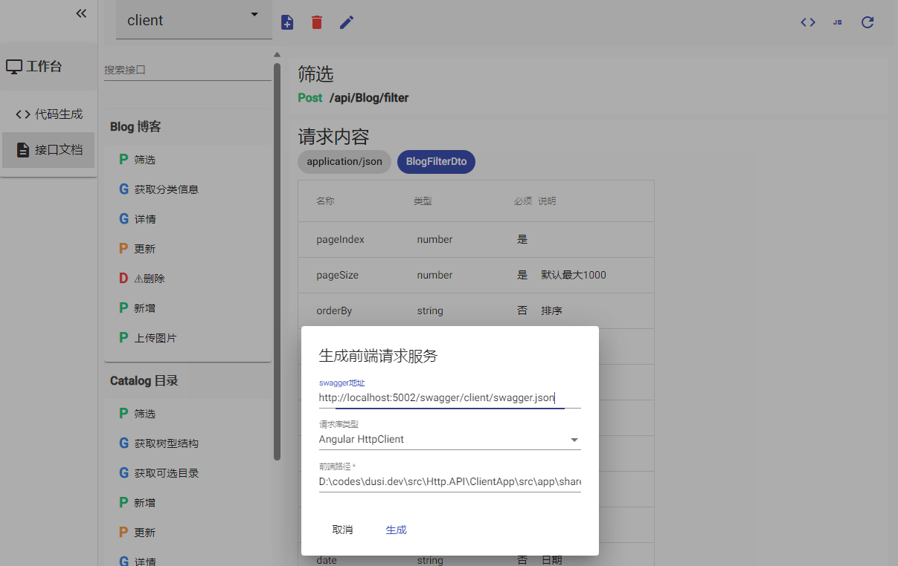

# Dry Studio

Dry studio provides developers with a Web UI to manage and generate code, which has the following advantages over using the command line:

- Visual operation, easier to learn and use
- Manage multiple projects
- Batch operation possible
- Other display content, such as API documentation and entity structure

## Start dry studio

All you need to do is type`dry studio`on the command line to launch the Web UI interface, which uses the local port`9160` to launch a web app.

## Using Dry Studio

🎉Congratulations, now you have successfully launched studio, here is how to use it!

### add project

First, you need to add an item. Enter the local absolute path of the item and click Add.

> [!NOTE]
>This path is usually the full path to`.sln`solution file. If you only need to generate code for your front-end project, you can also fill in the root directory path for your front-end project.

### Using Code Generator

After you add the solution as a project, select the project on the homepage, click to enter the workbench, you can view the solid model contained in the project, and generate the corresponding code by`代码生成` or`批量操作`button!

### viewing entities

View the solid model and generate code based on it:

Select what to generate

Online editing dto

### front-end code generation

To use front-end code generation, you first need to add`Swagger url`, please refer to the following steps:

- Go to the workbench and select`接口文档` menu
- Select Add Document and enter the required parameters
- If the address is correct, you can view the interface document. If the page is not refreshed, click the Refresh button in the upper right corner.
- After the document is loaded successfully, click`js` icon in the upper right corner to pop up the generation pop-up window.
- Fill in the corresponding parameters and click Generate

