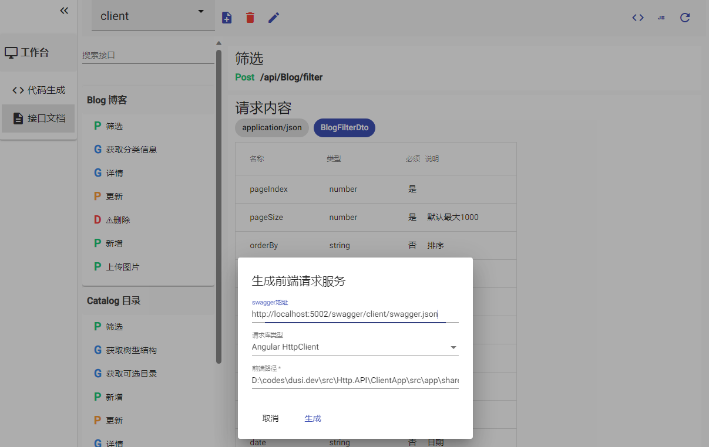

# 使用Droplet Studio

droplet studio 为开发者提供了Web UI 来管理和生成代码，相比使用命令行它具有以下优势：

- 可视化操作，更易学习和使用
- 对多个项目进行管理
- 可进行批量操作
- 其他展示内容，如API文档和实体结构等

## 启动droplet studio

您只需要在命令行当中输入`droplet studio`即可启动Web UI界面，它会使用本地端口`9160`来启动一个网页应用。

## 使用droplet studio

🎉恭喜，现在您已经成功启动了studio，下面来介绍如何使用它!

### 添加项目

首先，您需要先添加项目，请输入项目的本地绝对路径，然后点击添加。

> [!NOTE]
> 该路径通常为`.sln`解决方案文件的完整路径。如果您只需要为前端项目生成相应的代码，也可以填写您前端项目的根目录路径。

### 使用代码生成器

当你添加了解决方案作为项目后，在主页选择项目，点击进入工作台，即可查看项目中包含的实体模型，通过`代码生成`或`批量操作`按钮即可生成对应的代码！

### 查看实体

查看实体模型，并根据实体模型生成相应的代码:

选择要生成的内容

在线编辑dto

### 前端代码生成

要使用前端代码生成，您首先需要先添加`Swagger url`，请参照以下步骤：

- 进入工作台，选择`接口文档`菜单
- 选择添加文档，输入所需要的参数
- 如果地址正确，即可查看到接口文档，如果页面没有刷新，可点击右上角的刷新按钮
- 文档加载成功后，点击右上角`js`图标，弹出生成弹窗
- 填写相应的参数，然后点击生成

